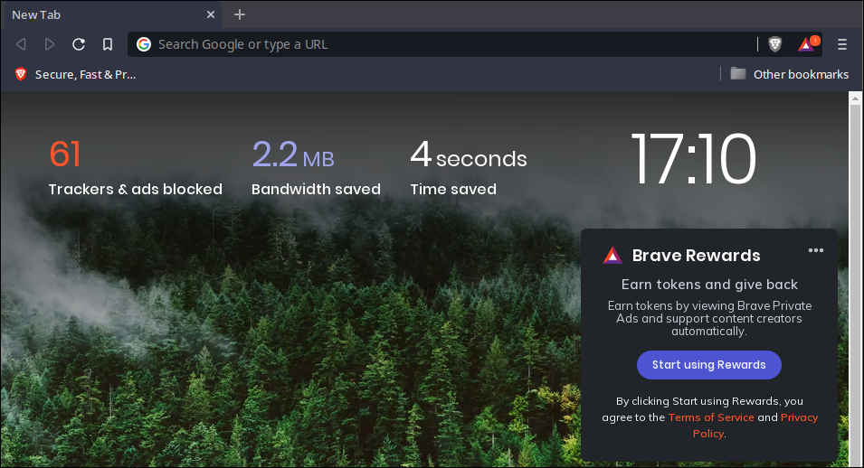
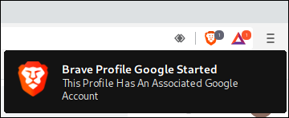

# 🦁 brave-profiles

Brave Browser profiles on linux

Blog: https://equk.co.uk/2021/09/22/brave-browser-profiles



## Summary

Simple script to easily create new brave profiles.

## Usage

Clone this repo and copy the script somewhere accessible.

You can then rename/copy the script to the profile name required (script filename = profile name).

Optionally you may also want to change the `profile_folder` variable (default is `$HOME/.brave_profiles`)

## Features

- [x] Easy creation of profiles
- [x] Sandbox Check
- [x] Custom commandline flags
- [x] Detect associated Google Account & alert user



## Linux Tweaks

### Enable Emojis

To enable emojis within brave browser you will need to install emoji fonts.

In Archlinux install `noto-fonts-emoji`

### Mouse Wheel Scrolling

You may want to tweak mouse scrolling speed in Brave (there don't seem to be any built in options to do this currently).

There are a few options to set mouse wheel preferences outisde of Brave.

I personally use `imwheel` as it allows me to set scrolling preferences per application.

#### imwheel

`~/.imwheelrc`

```
# Scroll Settings for Brave Browser
"^Brave-browser$"
    None, Up, Button4, 5
    None, Down, Button5, 5
    Shift_L,   Up,   Shift_L|Button4, 5
    Shift_L,   Down, Shift_L|Button5, 5
    Control_L, Up,   Control_L|Button4
    Control_L, Down, Control_L|Button5
```

## Why Use Profiles?

- [x] Keep Google services (& logins) seperate
- [x] Testing webapps
- [x] Seperate other services from main profile
- [x] Use differing configurations for services or webapps

## Notes

After looking at profile data it seems Brave stores a reference to cookies for Google Accounts within the profile preferences file.

I'm not sure if this relates to analytics or is specific to Google related extensions / features.

I have added a check using this to warn users when starting brave profiles. (as I have seperate profiles setup for Google services like Youtube etc)

## Contact

Website: https://equk.co.uk

Twitter: [@equilibriumuk](https://twitter.com/equilibriumuk)

